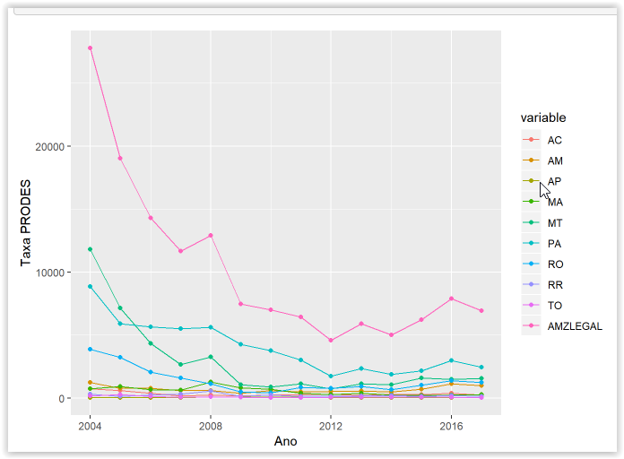
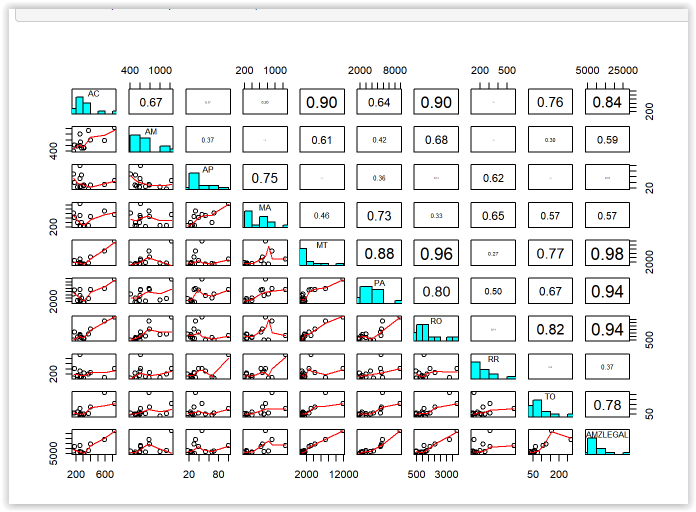
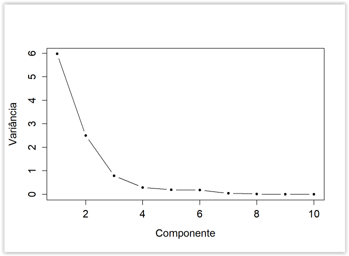
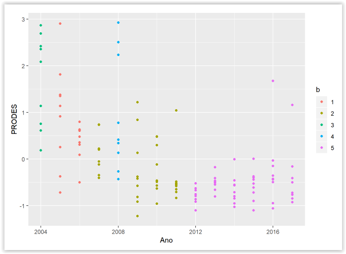
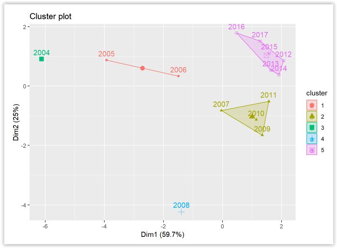

Queimada
Principal Component Analysis on Brazilian Burning

# Bibliotecas utilizadas  

```r

library(tidyverse)
library(knitr)
library(reshape2)
library(rgdal)
library(gdata)
library(factoextra)
```
# The study 

In this study we will make some analyzes of the PRODES rate, 
which are annual deforestation rates by region, which are used by the Brazilian government to establish public policies. The data are from 2004 to 2017, related to the states: AC, AM, AP, MA, MT, PA, RO, RR, TO, besides the Legal Amazon.

### Importing Data

```r
Dados = read.table("taxaprodes.txt", header = T)
kable(Dados)
```

### Descriptive statistics

```r
summary(Dados[,2:11])
```
 
 We can see that the highest burning ocorence index were in Legal Amazon and Mato Grosso.

 
```r
a = melt(Dados[,2:11]) %>% mutate(Ano = rep(2004:2017,10))

ggplot(a, aes(x = Ano, y = value, fill = variable,  colour=variable))  +
  geom_line(aes(group=variable))+
  geom_point(aes(group=variable)) +
  xlab("Ano") +
  ylab("Taxa PRODES") +
  scale_colour_discrete()

```
  

Another important information we must realize is that there has been a significant decrease in the 
burning of the Legal Amazon over the years. Probably for some kind of prevention, enforcement and care policy.

The correlations are greater for states that are next to each other.  

```r

#função retirada do help(pairs)
panel.hist <- function(x, ...)
{
  usr <- par("usr"); on.exit(par(usr))
  par(usr = c(usr[1:2], 0, 1.5) )
  h <- hist(x, plot = FALSE)
  breaks <- h$breaks; nB <- length(breaks)
  y <- h$counts; y <- y/max(y)
  rect(breaks[-nB], 0, breaks[-1], y, col = "cyan", ...)
}

#função retirada do help(pairs)
panel.cor <- function(x, y, digits = 2, prefix = "", cex.cor, ...)
{
  usr <- par("usr"); on.exit(par(usr))
  par(usr = c(0, 1, 0, 1))
  r <- abs(cor(x, y))
  txt <- format(c(r, 0.123456789), digits = digits)[1]
  txt <- paste0(prefix, txt)
  if(missing(cex.cor)) cex.cor <- 0.8/strwidth(txt)
  text(0.5, 0.5, txt, cex = cex.cor * r)
}

panel.lm <- function (x, y, col = par("col"), bg = NA, pch = par("pch"), 
    cex = 1, col.line="red") {
    points(x, y, pch = pch, col = col, bg = bg, cex = cex)
    ok <- is.finite(x) & is.finite(y)
    if (any(ok)) {
       abline(lm(y[ok]~x[ok]), col = col.line)
    }
}

pairs(Dados[,2:11], diag.panel = panel.hist, upper.panel = panel.cor,
      lower.panel = panel.smooth)

```



# Principal Component Analysis


```r
pdados = data.frame(Dados$Ano.Estados,scale(Dados[,-1]))
```


```r
cp = prcom(pdados[,2:11])
cp
summary(cp)
```
The first principal component accounts for about 59.75% of the total variance of standardized data. 
If we take the first three main components, we can achieve 92.64% of the total variance.

```r
plot(1:10, cp$sdev^2, type = "b", xlab = "Componente",
 ylab = "Variância", pch = 20, cex.axis = 1.3, cex.lab = 1.3)

```


```r
cp$sdev[1:2]*t(cp$rotation[,1:2])
```


# Clustering 


```r
set.seed(20)
#tpdados = t(pdados[,2:11])
#colnames(tpdados) = 2004:2017
rownames(pdados) = 2004:2017
pdados = pdados[,-1]
kdados = kmeans(pdados,5)
d = reshape2::melt(pdados)   

kdados
```


```r
d = d[-c(1:14),]
Ano = rep(2004:2017, 9)
e = data.frame(d, Ano)
names(e) = c("UF", "PRODES", "Ano")
kdados$cluster <- as.factor(kdados$cluster)
b = kdados$cluster
Ano = factor(names(b))
b = data.frame(Ano, b)
tabelafinal = merge(e,b, by.x = "Ano", by.y = "Ano")
ggplot(tabelafinal, aes(Ano, PRODES, color = b)) + geom_point()
```

```r
fviz_cluster(kdados, data = pdados)#1/sq
```

